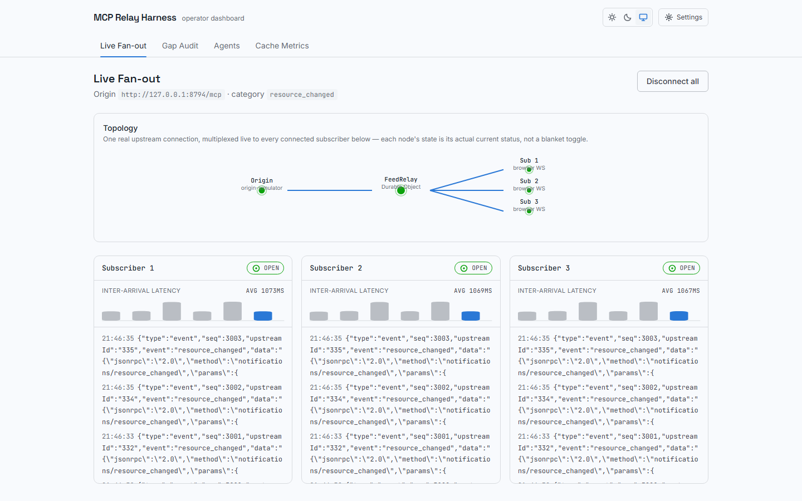
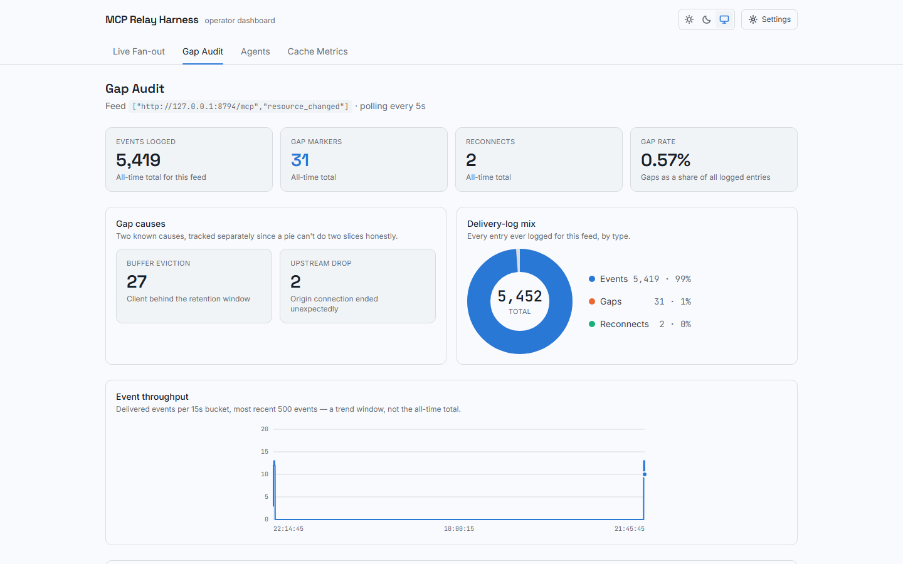
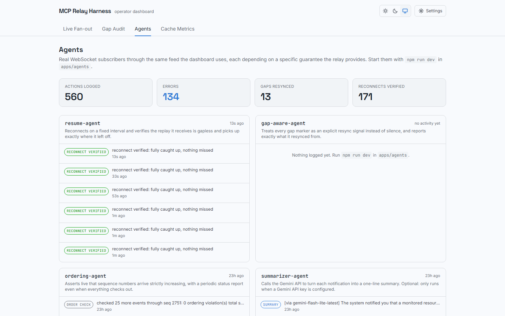
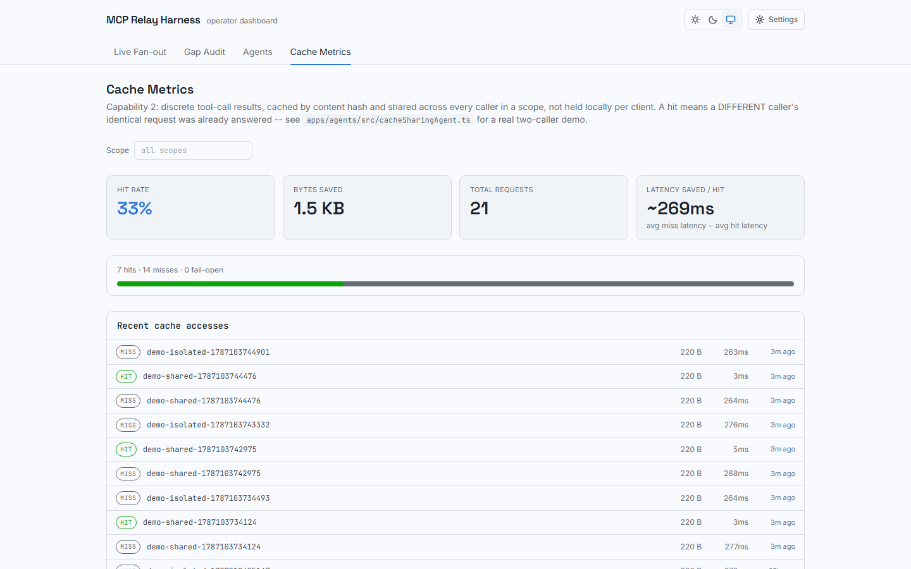

# MCP Relay Harness

An edge-native relay for MCP's `subscriptions/listen` notification streams, built on Cloudflare Workers and Durable Objects.

## Live

Deployed on Cloudflare, not just running locally.

- Dashboard: https://mcp-relay-harness-dashboard.ybains-dev.workers.dev
- Gateway: https://mcp-relay-harness-gateway-production.ybains-dev.workers.dev
- Origin simulator: https://mcp-relay-harness-origin-simulator.ybains-dev.workers.dev

The dashboard connects to the real deployed gateway by default. Auth uses a shared bearer token that is intentionally not baked into the public build; ask for it if you want to connect and watch the fan-out live.

## The problem

The MCP spec's July 2026 revision replaced `resources/subscribe`/`unsubscribe` with `subscriptions/listen`, a request-scoped, long-lived SSE stream. That revision also removed stream resumability entirely: if the connection breaks, the client re-issues the whole request from scratch, with no redelivery of what it missed. These are reasonable choices for a stateless-core protocol, but they leave a real gap once more than one client is involved. Ten agents subscribed to the same feed means ten independent fragile connections doing identical work against the origin, and a dropped connection means every one of them silently loses whatever happened while it was down.

MCP Relay Harness sits between the origin and its subscribers. It holds exactly one upstream `subscriptions/listen` connection per (origin, category) pair, fans it out live to every downstream client subscribed through it, and keeps a bounded recent replay buffer so a client that reconnects within that window gets replayed what it missed. Resumability is restored at the edge, without requiring the origin or the client to change.

## What's built

**Multiplexing and resumable replay**, the original scope of this project:

- One real upstream connection per feed, regardless of how many downstream clients subscribe to it, guaranteed even under concurrent subscribe requests by a Durable Object's single-threaded execution.
- A bounded replay buffer (200 events) that survives Durable Object hibernation and eviction, so a client reconnecting shortly after a disconnect gets exactly what it missed, in order.
- Every path that can lose an event (backpressure overflow, buffer eviction, or an upstream connection dropping) results in an explicit gap marker to the client, never silence. This is the project's central design commitment: a client can always tell the difference between "caught up" and "missed something," and never has to guess.
- Reconnect with full-jitter exponential backoff when the upstream connection drops, so a flaky origin doesn't turn into a retry storm.
- Every delivered event, gap, and reconnect logged to D1 for later audit, independent of the in-memory/DO-state fast path.
- Real Cloudflare Rate Limiting on both the subscribe and relay paths, keyed independently per route so one path's abuse can't exhaust the other's budget.

**Shared, content-addressed discrete-call cache**, originally a stretch goal, since built:

- `POST /relay` takes `{originUrl, scope, tool, arguments}`. If another caller in the same `scope` already asked the identical question, the answer is served from cache, byte-identical, and the origin is never touched a second time.
- Content-addressed by design: the cache index key is a BLAKE3 hash of a canonicalized (key-order-independent) encoding of the request, and the stored content is separately hashed by BLAKE3 too, so two different requests that happen to produce identical output legitimately share storage.
- Backed by a second Durable Object, `ContextIndex`, one instance per `scope` via `idFromName`. Scope isolation is structural, since two different scopes are two entirely separate SQLite databases, not a runtime check that could have a bug in it.
- Fails open on any cache-index failure, not just an honest miss. If `ContextIndex` itself can't be reached, the route falls through to a real origin call rather than erroring, exactly the same as an ordinary cold miss. A genuine origin failure is never papered over, and never gets cached.
- Proven against a real synthetic origin, not a mock: `apps/origin-simulator`'s `resource_lookup` tool returns a monotonically increasing call counter that only advances on a real call, so "this came from cache" is independently verifiable, not inferred from response time alone. `apps/agents/src/cacheSharingAgent.ts` (`npm run demo:cache`) drives two distinct logical callers through the real dev stack end to end and asserts on exactly that.

See `docs/ARCHITECTURE.md`'s "Capability 2" section for the full design, including why the cache index ended up on Durable Object SQLite rather than the Cache API/KV the original plan sketch named.

**Four real agent consumers**, added on top of the relay once it was working, to answer a different question than the test suite does: not "is the relay correct" but "does that correctness actually matter to something depending on it." Each agent in `apps/agents` is a genuine WebSocket subscriber through the same `/subscribe` endpoint any client uses, and each one's own logic depends on a specific guarantee the relay makes:

- **resume-agent** reconnects on a fixed interval and verifies the replay it gets back is gapless and picks up exactly where it left off.
- **gap-aware-agent** treats every gap marker as an explicit resync signal, never as silence.
- **ordering-agent** asserts live that sequence numbers arrive strictly increasing, with a periodic status report.
- **summarizer-agent** (optional) calls the Gemini API to turn each notification into a one-line summary. Only runs if a Gemini key is configured; the other three work fully without it.

MCP is the protocol AI agents use to talk to tools and resources, so this isn't a stretch. It's the actual shape of who consumes a feed like this. Every agent's decision is logged and shown live in the dashboard's Agents view.

## Architecture

```
                    one real upstream connection
  origin (MCP server)  <----------------------------  FeedRelay (Durable Object)
   subscriptions/listen                                     |  hibernatable WebSocket
                                                              |  fan-out, N downstream
                                    -----------------------------------------------------
                                    |            |            |                         |
                              subscriber 1  subscriber 2  subscriber 3 ...      apps/agents (4 real consumers)

                    discrete tools/call, cached by content hash, shared per scope
  origin (MCP server)  <---------------------------------------------------------  ContextIndex (Durable Object)
   tools/call                                                                       ^  one instance per scope
                                                                                     |
                                                                        POST /relay {originUrl, scope, tool, arguments}
                                                                            ^                    ^
                                                                     caller A (miss)      caller B (hit, same scope)

  Worker (apps/gateway)                   D1 (delivery_log, agent_log, cache_log)
    /subscribe  -> routes to the FeedRelay DO keyed on (originUrl, category)
    /relay      -> routes to the ContextIndex DO keyed on scope, fails open to a real origin call on any miss
    /api/delivery-log, /api/delivery-log/counts  -> relay history, read by the dashboard
    /api/agent-log, /api/agent-log/counts        -> agent activity, read by the dashboard
    /api/cache-log, /api/cache-log/stats         -> cache hit/miss history, read by the dashboard
```

- **`apps/gateway`** (Cloudflare Worker + two Durable Object classes): the relay itself. `FeedRelay` is one DO instance per feed; it owns the single upstream connection, the replay buffer, and fan-out to every downstream hibernatable WebSocket. `ContextIndex` is one DO instance per cache `scope`; it owns that scope's content-addressed cache index.
- **`crates/mcp-relay-engine`** (Rust, compiled to WASM): incremental, chunk-boundary-safe SSE parsing, plus BLAKE3 content hashing for the cache. The upstream response body is a stream that can split an event across two chunks at any byte offset; this is a real parser for that, not a naive split-on-newline. Both are wired directly into the gateway's real request paths, not standalone demos.
- **`apps/origin-simulator`** (Cloudflare Worker): a synthetic MCP origin implementing the `subscriptions/listen` shape and a `tools/call` shape (one deterministic `resource_lookup` tool, with a real artificial latency and a call counter that only advances on a genuine call), for local dev and the chaos harness. Clearly not a real MCP server, and not meant to be.
- **`apps/agents`** (Node/TypeScript): four real WebSocket consumers of the relay, each exercising a specific correctness property live, plus `cacheSharingAgent.ts` (`npm run demo:cache`), a real two-caller demonstration of the cache capability. See "Four real agent consumers" above.
- **`apps/dashboard`** (React + Tailwind, on Vite, deployed to Cloudflare Pages): an operator view. Live Fan-out shows the real topology and per-subscriber message stream; Gap Audit shows every gap marker ever issued against this feed, with cause and true totals; Agents shows what each of the four consumers is actually doing; Cache Metrics shows real hit rate, bytes saved, and latency saved for the cache capability.
- **`eval`** (Python, `uv`-managed): a chaos-testing harness that kills and restarts the real origin process mid-run, or flaps downstream connections on a schedule, and asserts on the resulting message stream for no silent gaps, no duplicate sequence numbers, correct ordering, correct replay.

## Why this design, specifically

- **Durable Objects (SQLite storage class) for the relay.** One DO per feed is what makes "exactly one upstream connection, even under concurrent subscribe requests" a guarantee instead of a race to defend against. Hibernation means idle downstream connections cost nothing while waiting for the next event.
- **The asymmetry is real and stated, not glossed over.** Hibernation covers the DO's incoming downstream WebSockets. It does not cover the DO's own outgoing leg: the upstream `subscriptions/listen` connection is a `fetch()` with a streamed body the DO has to actively keep reading, which keeps the instance resident the whole time that connection is open, independent of downstream subscriber count. That's a real, measurable cost, not a detail to imply away. Measuring it (correctness property 4b in `PLAN.md`) is possible now that a real deploy exists, and is still an open item rather than a finished one.
- **No queue-depth signal from the platform, so the backpressure story is scoped to what's actually detectable.** Cloudflare's hibernatable WebSocket `send()` exposes no `bufferedAmount` or equivalent (checked against `cloudflare/workerd#988`, open since 2023). There is no way for a Durable Object to tell that one specific downstream client is genuinely network-slow. What's built instead is a bounded per-socket outbound queue. If a single upstream chunk produces more events than the cap, the oldest queued ones for that socket are dropped and the client gets an explicit gap marker before the survivors. This guarantees the DO's own memory can't grow unboundedly and that any drop is always signaled, but it does not guarantee reacting to a slow network client, because the platform gives no signal to react to.
- **Cross-Worker calls use a service binding where one applies, plain fetch everywhere else.** The origin simulator is itself another Worker on the same account's `workers.dev` zone, and a plain `fetch()` between two `workers.dev` Workers is rejected by Cloudflare with error 1042, a real loop-prevention restriction confirmed live during deployment. A service binding is Cloudflare's own recommended fix for exactly this shape, wired in only for that one known host; every other allowlisted origin still goes through a normal fetch, unaffected.

## Dashboard

<table>
<tr>
<td><br><sub>Live Fan-out: real per-subscriber WebSocket connections, not simulated</sub></td>
<td><br><sub>Gap Audit: true totals via the counts endpoint, gap causes, throughput trend</sub></td>
</tr>
<tr>
<td><br><sub>Agents: what each of the four real consumers is actually doing</sub></td>
<td><br><sub>Cache Metrics: real hit rate, bytes saved, and per-scope access log</sub></td>
</tr>
</table>

## Verified, not assumed

Every claim above has a check behind it, not just a design doc.

| Layer | Check | Result |
|---|---|---|
| Rust SSE parser, replay buffer, and BLAKE3 hashing | `cargo test` | 30/30 passing, including the published BLAKE3 empty-input test vector, asserted as a known value |
| Rust engine | `cargo clippy --all-targets` | clean |
| Gateway (real `workerd` runtime, real DO/D1 bindings via `@cloudflare/vitest-pool-workers`) | `vitest run` | 120/120 passing |
| Gateway | `wrangler deploy --env production` | live on Cloudflare, 83.6 KiB / 31 KiB gzip, comfortably inside the Workers free-tier 3 MiB gzip cap |
| Dashboard | `tsc -b` + `vite build` + `oxlint` | clean, deployed to Cloudflare Pages |
| Agents | `tsc --noEmit` | clean |
| Agents (against a real live gateway and origin simulator) | resume-agent, gap-aware-agent, ordering-agent | each logged the expected real activity: reconnects verified gapless, a real killed-process outage correctly resynced, zero ordering violations across live events |
| summarizer-agent (against the real Gemini API, a real user-provided free-tier key) | live run | produced real one-line summaries end to end after fixing real bugs, including a dead default model and an empty-string env fallback |
| cacheSharingAgent (against a real live gateway and origin simulator) | `npm run demo:cache` | a second caller's identical request hit the cache the first caller populated, byte-identical, same `originCallSeq`, roughly 14 times faster; an unrelated scope's identical request correctly missed |
| Chaos harness | `pytest` | 28/28 passing |
| Full-codebase security review | manual review plus live testing | zero real vulnerabilities in the original codebase; one real high-severity bug found in a later change (see below) and fixed the same night |
| Rate limiting, live on production | manually driven past the limit | first 30 requests in a 60-second window succeed, the 31st onward correctly returns 429, verified against the real deployed gateway, not a local simulation |

The chaos harness doesn't mock failures. `upstream-outage` kills and restarts the actual `origin-simulator` process mid-run with `taskkill`; `downstream-flap` repeatedly disconnects and reconnects real WebSocket clients against a live gateway on a randomized schedule. Both scenarios have real recorded runs in `eval/results/`:

| Scenario | Messages observed | Violations |
|---|---|---|
| upstream-outage | 68 | 0 |
| upstream-outage | 64 | 0 |
| downstream-flap | 122 | 0 |

"Violations" here means a silent gap (an event skipped with no gap marker), a duplicate sequence number, an out-of-order delivery, or a replay that isn't self-consistent with what was actually sent. Zero across all three runs.

## A real bug, found and fixed

Adding Cloudflare's Rate Limiting binding introduced a genuine authentication bypass, caught by a focused security review of that specific change rather than assumed safe. `isAuthorized` compared a SHA-256 digest of the caller-provided token against a digest of `SUBSCRIBE_TOKEN`, but never checked whether `SUBSCRIBE_TOKEN` itself was actually set. `TextEncoder.encode(undefined)` produces the identical empty byte array as `TextEncoder.encode("")`, confirmed by testing, so a deployment where the secret was never configured (a real, plausible mistake if `wrangler secret put` is ever run against the wrong named environment) would silently authorize any caller sending zero credentials at all.

The fix is a single explicit guard: reject outright when `SUBSCRIBE_TOKEN` is missing, before any comparison happens. Verified with a new test asserting the fixed behavior, and confirmed live against the real deployment that a valid token still works while a request with no credentials now correctly returns 401.

## Known gaps, stated rather than hidden

- **Auth is a shared bearer token, not per-agent identity.** Enough to prove the caller holds a shared secret; not real authorization. Documented as a deliberate v1 scope cut, not an oversight. The cache's `scope` inherits this same boundary: it's a caller-supplied string, not derived from real authenticated identity, since there is no real per-caller identity yet to derive it from. What is real regardless: two different scope strings can never observe each other's cached entries, a structural guarantee independent of how weak the identity model around `scope` itself currently is.
- **SSRF-relevant input is checked; the token model is not the strongest possible.** `originUrl` is validated against an explicit allowlist before the relay ever calls `fetch()` on it (see `isAllowedOrigin` in `apps/gateway/src/routes/subscribe.ts`, reused unchanged by `/relay`), and the auth token comparison is constant-time. Both are real, not theatrical, but the underlying trust model of one shared secret is the known gap above.
- **The measured upstream-residency cost (correctness property 4b) hasn't been collected yet.** The design and the reasoning behind it are documented above; the actual GB-seconds number from a real deployment under load is the one item from the original plan still open.

## Running it locally

Requires Node 20+, Rust with the `wasm32-unknown-unknown` target, `wasm-pack`, and `uv` for the Python harness.

```bash
# build the WASM SSE parser the gateway depends on
cd apps/gateway && npm run build:wasm

# terminal 1: synthetic upstream feed
cd apps/origin-simulator && npm run dev

# terminal 2: the relay (applies D1 migrations locally on first run)
cd apps/gateway && npm run dev

# terminal 3: the operator dashboard
cd apps/dashboard && npm run dev

# terminal 4 (optional): the four agent consumers
cd apps/agents && cp .env.example .env && npm install && npm run dev

# optional, once the above three terminals are up: the cache demo
cd apps/agents && npm run demo:cache
```

Then open the dashboard, point it at the running gateway and origin-simulator (defaults match the ports above), and connect a few subscribers to watch the fan-out live. See `docs/DEMO_SCRIPT.md` for a guided walkthrough, and `eval/README.md` for running the chaos harness.

The gateway and origin-simulator's dev ports are pinned via `[dev]` blocks in their own `wrangler.toml` (8787 and 8794) rather than left to wrangler's default-with-auto-increment behavior. Found necessary by testing, not assumed: with no pinned port, the two Workers can race for the same default port, and the loser silently lands one port over with no error, breaking every hardcoded reference to it across the dashboard and this README.

## Deploying it yourself

The gateway's `wrangler.toml` defines a `production` named environment that adds a service binding to `origin-simulator`, needed only because both happen to live on the same account's `workers.dev` zone in this project's own deployment. A real MCP origin hosted elsewhere would never need it.

```bash
# origin-simulator
cd apps/origin-simulator && npx wrangler deploy

# gateway: creates the D1 database once, then deploys to the production environment
cd apps/gateway
npx wrangler d1 create mcp-relay-harness-delivery-log   # first time only, then update wrangler.toml with the real id
npx wrangler secret put SUBSCRIBE_TOKEN --env production
npm run deploy

# dashboard, to Cloudflare Pages
cd apps/dashboard && npm run build && npx wrangler deploy
```

## Repo layout

```
apps/gateway/            Worker + FeedRelay/ContextIndex Durable Objects, the relay itself
apps/origin-simulator/   synthetic MCP origin for dev and chaos testing
apps/agents/             four real WebSocket agent consumers, plus the cache-sharing demo
apps/dashboard/          React + Tailwind operator dashboard
crates/mcp-relay-engine/  Rust -> WASM: SSE framing, replay ring buffer, BLAKE3 hashing
eval/                    Python chaos-testing harness and recorded results
docs/                    architecture notes and a guided demo script
PLAN.md                  the original scoping document this was built against
```

## Tooling

TypeScript throughout the gateway, agents, and dashboard, tested with `vitest` against a real `workerd` runtime via `@cloudflare/vitest-pool-workers`, not a mock. Rust engine tested with `cargo test`, linted with `clippy`. Dashboard built with React 19, Tailwind v4, and Vite. Agents run as plain Node scripts, using Node 22's native TypeScript execution with no build step. Chaos harness in Python, managed with `uv`, tested with `pytest`, linted with `ruff`. Cloudflare's Rate Limiting API for abuse protection, not a hand-rolled counter. Lockfiles committed for every language.

## License

MIT, see `LICENSE`.
