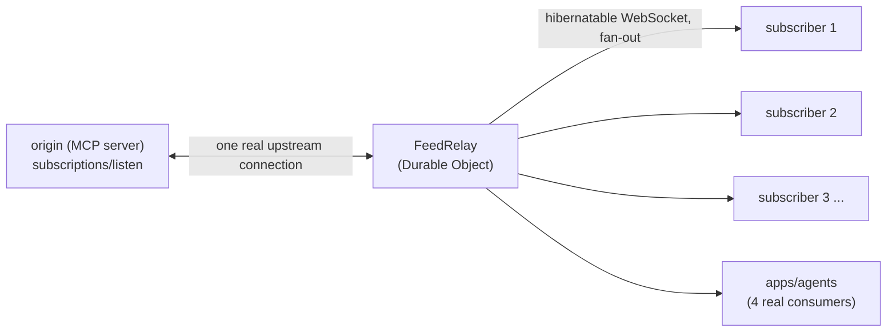
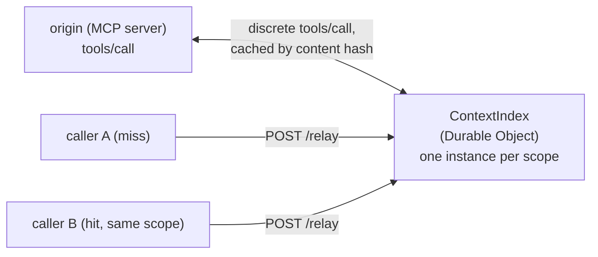

# MCP Relay Harness: Technical Overview

A comprehensive technical account of what this project is, why it exists, how it's built, and what
has been verified about it. Compiled directly from the source tree, test suites, and design docs
(`README.md`, `docs/ARCHITECTURE.md`, `PLAN.md`) as of 2026-08-22. Every number in this document
traces to a real test run, a real file, or a real recorded result, none are estimated.

---

## 1. Purpose

**MCP** (Model Context Protocol) is the protocol AI agents use to call tools and subscribe to
notifications from servers. Its **2026-07-28 spec revision** made two deliberate, spec-level
changes:

1. `subscriptions/listen` replaced the older `resources/subscribe`/`unsubscribe` pair. It is a
   request-scoped, long-lived SSE stream, and the revision removed resumability entirely. Per
   the spec text: *"A broken response stream loses the in-flight request; clients MUST re-issue it
   as a new request."* There is no Last-Event-ID, no server-side redelivery. A dropped connection
   means the client loses everything that happened while it was down, silently, unless it
   independently notices and resubscribes.
2. Discrete calls (`tools/list`, `prompts/list`, `resources/list`, `resources/read`) gained
   `ttlMs`/`cacheScope` hints for client-local caching only, there is no shared, cross-client
   cache defined by the spec.

Both are reasonable choices for a stateless-core protocol, and both leave the same structural gap:
everything is scoped to exactly one client. Ten agents subscribed to the same notification feed
are ten independent, fragile connections doing identical work against the origin, and a dropped
connection silently loses data for whichever agent happened to be connected at the time. Two agents
asking an origin the identical question is two full round trips instead of one plus a cache hit.

This project is the missing shared infrastructure layer: an edge-native relay that sits between an
MCP origin and every one of its subscribers/callers, and makes both of those spec-level per-client
gaps into shared, multi-client guarantees, without requiring either the origin server or the
client to change.

Prior art was checked, not assumed absent. Real MCP gateways exist: IBM's ContextForge
(federation + Redis-backed caching), Lunar's MCPX (AI control-plane, access control/audit), AIRIS
(Docker-based tool multiplexer), Gate22 (governance/control plane). None target this specific gap:
an edge-native (not traditional server infrastructure), Durable-Object-backed implementation built
directly against what the 2026-07-28 revision removed.

---

## 2. System architecture

| Route | Routes to | Notes |
|---|---|---|
| `/subscribe` | `FeedRelay` DO, keyed on `(originUrl, category)` | Auth + rate limit first |
| `/relay` | `ContextIndex` DO, keyed on `scope` | Auth + rate limit first; fails open to a real origin call on any miss |
| `/api/delivery-log`, `/api/delivery-log/counts` | D1 `delivery_log` | Relay history, read by the dashboard |
| `/api/agent-log`, `/api/agent-log/counts` | D1 `agent_log` | Agent activity, read by the dashboard |
| `/api/cache-log`, `/api/cache-log/stats` | D1 `cache_log` | Cache hit/miss history, read by the dashboard |

### Component inventory

| Component | Role | Language / runtime |
|---|---|---|
| `apps/gateway` | Cloudflare Worker entry point + 2 Durable Object classes (`FeedRelay`, `ContextIndex`) | TypeScript, `workerd` |
| `crates/mcp-relay-engine` | SSE framing, replay ring buffer, BLAKE3 hashing, compiled to WASM | Rust to `wasm32-unknown-unknown` |
| `apps/origin-simulator` | Synthetic MCP origin (`subscriptions/listen` + `tools/call` shapes) for dev and chaos testing | TypeScript, Cloudflare Worker |
| `apps/agents` | 4 real WebSocket agent consumers + a 2-caller cache-sharing demo | TypeScript, Node 22+ (native TS execution, no build step) |
| `apps/dashboard` | Operator UI: live fan-out topology, gap audit, agent activity, cache metrics | React 19, Tailwind v4, Vite |
| `eval/` | Chaos-testing harness, kills real processes, flaps real connections, asserts on correctness | Python, `uv`-managed |

All five apps are deployed to real Cloudflare infrastructure: `apps/gateway` and
`apps/origin-simulator` as Workers, `apps/dashboard` on Workers Static Assets. See section 8 for
what's been verified live rather than only locally.

---

## 3. Capability 1: Subscription multiplexing and resumable replay

### 3.1 Request flow

1. A client opens a WebSocket to `/subscribe?originUrl=...&category=...&lastSeenSeq=0`.
2. `handleSubscribe` (`apps/gateway/src/routes/subscribe.ts`) checks the bearer token, checks the
   rate limit, validates `originUrl` against an explicit host allowlist (`isAllowedOrigin`, SSRF-relevant input,
   checked before any `fetch()` on user-supplied input), derives a feed key from
   `(originUrl, category)`, and routes to the `FeedRelay` DO instance for that key via `idFromName`.
3. Every subscriber to the same `(originUrl, category)` pair derives the same feed key and lands on
   the same DO instance, that is the entire multiplexing mechanism. It's routing, not a separate
   coordination layer.
4. Inside `FeedRelay.fetch()`: accept the WebSocket as hibernatable (`ctx.acceptWebSocket`), cancel
   any pending idle-teardown alarm, start the upstream connection if not already running, and send
   the client either a replay of buffered events since `lastSeenSeq` or an explicit gap marker if
   `lastSeenSeq` predates what's retained.

### 3.2 Exactly-once upstream connection under concurrent subscribes

The check-then-set on `upstreamStarted` executes with no `await` in between, because Durable Object
method invocations only auto-serialize across single synchronous statements, not across an `await`
boundary. `connectUpstream` is deliberately not awaited inline, it's handed to `ctx.waitUntil` so
the subscribe response returns immediately while the upstream connection establishes (or continues)
in the background. This is what turns "exactly one upstream connection per feed, even under
concurrent subscribe requests" from a race condition to defend against into a structural guarantee
of the platform's single-threaded DO execution model.

### 3.3 Replay buffer

A plain class field does not survive Durable Object eviction, only `ctx.storage` and
already-accepted hibernatable WebSockets do (confirmed by a dedicated eviction test in
`FeedRelay.test.ts`, not assumed). So the buffer (`buf`) and its sequence counter (`nextSeq`) are
write-through to `ctx.storage.sql` (the SQLite storage backend, provisioned via `new_sqlite_classes`
in `wrangler.toml`) on every event, and hydrated back in the constructor via
`blockConcurrencyWhile` before the instance serves any request.

- Holds the 200 most recent events.
- A reconnecting client sends `lastSeenSeq`. If the oldest buffered event is still within that
  range, it receives everything since. If not, it receives an explicit gap marker naming the oldest
  sequence number still available, never a silent partial replay.

### 3.4 SSE parsing: chunk-boundary-safe, in Rust, compiled to WASM

The upstream response body is read via the Streams API as a long-lived stream. An SSE event can
legally split across two chunk boundaries at any byte offset, including mid-field-name or
mid-line-terminator. `crates/mcp-relay-engine/src/sse_framing.rs` (301 lines) implements a real
incremental parser for this, tested against exactly those boundary conditions:
`split_mid_field_name`, `split_exactly_between_the_two_newlines_of_the_blank_line`,
`split_exactly_between_cr_and_lf_of_a_crlf_terminator`, and others. Compiled to WASM and
instantiated directly inside `FeedRelay`'s read loop (`WasmSseParser`, wired at `FeedRelay.ts:308`).

The ring buffer (`ring_buffer.rs`, 235 lines, 25 tests) is the reference implementation for replay
semantics, but `FeedRelay` reimplements the buffer natively in TypeScript against
`ctx.storage.sql` rather than calling into WASM for it, a deliberate decision, not an oversight.
Routing the buffer through WASM's linear memory would mean manually serializing the whole buffer to
durable storage around every call, for logic simple enough that a native reimplementation is more
honest. The distinction: the SSE parser's state is fine to lose on a genuine restart (equivalent to
a reconnect anyway); the replay buffer's state is not.

**The `wasm-pack`/Cloudflare-bundler mismatch.** `wasm-pack build --target bundler` generates glue
that assumes webpack's wasm-loader semantics: `import * as wasm from "*.wasm"` yielding an
already-instantiated exports object. Cloudflare Workers' bundler instead resolves a `.wasm` import
to a raw, uninstantiated `WebAssembly.Module` (confirmed against Cloudflare's own docs). The
generated entry point fails at top level with `wasm.__wbindgen_start is not a function` the moment
it's imported, unmodified. Fixed in `apps/gateway/src/lib/wasmEngine.ts` by instantiating the
module directly against the exact import object the compiled binary declares, verified via
`WebAssembly.Module.imports()` rather than guessed: the module declares exactly one import,
`__wbindgen_init_externref_table`, from a namespace matching its own glue file, which the generated
`bindgen` exports already provide.

### 3.5 Backpressure: precisely scoped to what the platform can detect

Cloudflare's hibernatable WebSocket `send()` exposes no `bufferedAmount` or any queue-depth
signal (checked against `cloudflare/workerd#988`, open since August 2023, confirmed still open).
A Durable Object has no platform-level way to detect that one specific downstream client is
genuinely network-slow.

What's built instead: a per-socket bounded outbound queue (`OUTBOUND_BURST_CAPACITY = 20`).
Each upstream chunk's parsed batch of events is queued per subscriber before any are sent. If a
batch pushes a socket's queue past the cap, the oldest queued events for that socket are dropped and
the survivors are preceded by an explicit gap marker at flush time. Flushing happens once per
upstream chunk, not once per event, draining per-event would make the cap meaningless, since the
queue would then never hold more than one item at a time.

This guarantees: the DO's own memory per subscriber cannot grow unboundedly regardless of upstream
burst size, and any resulting drop is always signaled, never silent. It does not, and cannot,
detect or react to a genuinely slow network client, the platform provides no signal for that. This
distinction (burst-volume protection vs. true network-backpressure detection) is stated precisely,
not implied to be more than it is.

### 3.6 Reconnect and gap marking on upstream failure

Per the MCP spec, a broken response stream unconditionally loses whatever was in flight, there's
no server-side redelivery to fall back on. So `connectUpstream` always broadcasts a gap marker
before attempting to reconnect on any upstream disconnect, expected or not, since there's no way to
know whether anything was actually missed.

Reconnection uses full-jitter exponential backoff (`computeBackoffMs`, the Marc Brooker / AWS
Architecture Blog formula): the retry ceiling grows exponentially and is capped, and the actual
delay is drawn uniformly from `[0, ceiling]`. A fixed-offset jitter still lets every DO retrying
against the same failed origin drift back into lockstep after a few attempts; a full random draw
each time doesn't.

`outageSignaled` tracks whether the current outage has already been announced, so a connection that
drops and reconnects signals once, not on every retry attempt. It resets at two points, both
covered by tests: intentional teardown (idle timeout) and the "no subscribers left, give up" path,
both matter for the same reason: a future subscriber to a feed that's fully restarted from scratch
must not inherit a stale "already told you about a drop" flag left over from a different
subscriber's outage.

A related bug was found during extended local testing: the retry loop runs inside `ctx.waitUntil`,
outside the request's own call stack, so an uncaught exception mid-loop would silently end the loop
every subscriber depends on rather than surfacing anywhere. Fixed by wrapping the loop body in its
own `try`/`catch`, so an unexpected error is logged and treated as an ordinary failed connection
attempt, keeping the retry-with-backoff cycle alive instead of leaving the feed permanently dark.

### 3.7 Idle teardown

Five seconds after the last downstream subscriber disconnects, an alarm fires and cancels the
upstream connection. Not zero: a client that reconnects within a few seconds (a page refresh, a
brief network blip) reuses the still-live upstream connection and its buffered history instead of
paying a fresh subscribe round trip. Not indefinite either: an idle feed with zero listeners would
otherwise hold its upstream connection open, and billed as DO residency time, forever. This grace
period was arrived at empirically, not designed up front.

### 3.8 Delivery log

Every delivered event, gap marker, and successful reconnect is logged to D1 through `logDelivery`,
called via `ctx.waitUntil` so a failed or slow observability write never blocks or fails live
delivery. Writes go through D1's Sessions API (`withSession("first-primary")`) for
bookmark-based sequential consistency, relevant because the dashboard reads this data shortly
after it's written.

Two read endpoints exist on purpose: `GET /api/delivery-log` (row-window queries, filterable by
feed key and entry type) and `GET /api/delivery-log/counts` (true per-type totals via `GROUP BY`,
independent of any row window). The counts endpoint exists because a real bug was caught building
the Gap Audit dashboard view against the row-window endpoint alone: a long-running feed logs an
`event` row roughly once a second, so a fixed-size row window, even a generously large one,
eventually pushes rare `gap`/`reconnect` rows out of the fetched range entirely, silently
understating total counts to zero on a feed that had genuinely logged gaps hours earlier. Any KPI
claiming to be a total, not a "most recent N," is required to come from the counts endpoint. The
same discipline was applied preemptively to the agent-log and cache-log endpoints once the pattern
was understood.

### 3.9 Rate limiting

`isRateLimited` (`apps/gateway/src/routes/subscribe.ts`) checks a real Cloudflare Rate Limiting
binding (`RATE_LIMITER`), not a hand-rolled counter, after auth succeeds and before either route
does any real work. `/subscribe` and `/relay` share one binding but keep independent buckets via a
`routeKey:clientKey` key, so exhausting one route's budget doesn't touch the other's.

The binding runs in remote mode under local `wrangler dev`, meaning it needs real Cloudflare auth
to answer and hangs rather than errors when it can't reach it, which would stall every local
request indefinitely on a bare `await`. The check runs inside a 500ms `Promise.race` against a
timeout and fails open on either a timeout or a thrown error, the same principle already applied to
`ContextIndex`'s cache lookup: an infrastructure hiccup should degrade availability, not block a
real request.

Verified live against production, not only locally: driven past the limit using the caller's actual
client IP (Cloudflare's edge rejects a client-supplied `CF-Connecting-IP` header outright with error
1000, so the rate-limit key can't be spoofed by the caller). The first 30 requests in a 60-second
window succeeded; the 31st and beyond correctly returned 429.

### 3.10 A real authentication bypass, found and fixed

Adding the rate limiter prompted a security review scoped to that specific diff rather than assumed
safe. It found that `isAuthorized` compared a SHA-256 digest of the caller-supplied token against a
digest of `env.SUBSCRIBE_TOKEN`, using a constant-time XOR diff to avoid a timing side channel, but
never checked whether `SUBSCRIBE_TOKEN` itself was actually set.

`TextEncoder.encode(undefined)` produces the identical empty byte array as `TextEncoder.encode("")`,
confirmed directly with a Node test. So a deployment where the secret was never configured, a real
and plausible mistake if `wrangler secret put` were ever run against the wrong named environment,
would silently authorize any caller sending zero credentials at all.

The fix is one explicit guard at the top of `isAuthorized`: reject outright, before any comparison
runs, if `env.SUBSCRIBE_TOKEN` is falsy. Covered by two new tests and confirmed live against the
real deployment: a valid token still succeeds, and a request with no credentials now correctly
returns 401.

---

## 4. Capability 2: Shared, content-addressed discrete-call cache

Where Capability 1 multiplexes a long-lived stream, Capability 2 does the equivalent for a one-shot
`tools/call`: a caller `POST`s `{originUrl, scope, tool, arguments}` to `/relay`; if another caller
in the same `scope` already asked the identical question, the answer is served from cache,
byte-identical, and the origin is never touched a second time.

### 4.1 Two hashes, not one

`buildRequestHash` (`apps/gateway/src/lib/cacheKey.ts`, 63 lines) hashes a canonicalized,
recursively key-sorted JSON encoding of `{originUrl, tool, arguments}`, the cache's index key,
identifying "this exact call" independent of how a particular HTTP client happened to order its
JSON keys. Separately, once a real call succeeds, its raw response body is hashed again to produce
the content address (`resultHash`) the bytes are stored under. Two different requests that happen
to produce byte-identical output legitimately share a `resultHash`, that's content-addressing
working as intended, not a collision to worry about.

Both hashes are BLAKE3, computed by a WASM export (`blake3_hex`,
`crates/mcp-relay-engine/src/hash.rs`, 78 lines, 5 tests including the published BLAKE3
empty-input test vector asserted as a known value, so a future dependency bump that silently
changed the algorithm would be caught).

### 4.2 Storage: Durable Object SQLite, not Cache API/KV, a revised decision

The original plan sketch (`PLAN.md`, written before this was built) named this
`cacheClient.ts # Cache API / KV read-write`. Building it surfaced the same tension Capability 1's
replay buffer had already resolved once: the Cache API's best-effort, evict-at-any-time,
edge-local semantics make the correctness properties this cache needs to demonstrate
(byte-identical replay, scope isolation) hard to pin down deterministically in a test.
`ContextIndex` (`apps/gateway/src/do/ContextIndex.ts`, 156 lines) is a Durable Object instead, one
instance per `scope`, keyed via `idFromName`, backed by `ctx.storage.sql`, the same storage
mechanism `FeedRelay`'s own replay buffer uses, for the same reason.

Scope isolation is structural, not a runtime check. Two different scopes are two different DO
instances with two entirely separate SQLite databases. There is no code path inside `ContextIndex`
that could leak one scope's entry into another's lookup, a bug there would have to be
`routes/relay.ts` routing to the wrong DO instance, a distinct and separately-tested failure mode.

### 4.3 Fail-open, precisely scoped

Two distinct situations converge on the same behavior: a genuine miss (the index has never seen
this request) and an index failure (the RPC call to `ContextIndex` throws). `ContextIndex` exposes
`lookup`/`store` as real RPC methods, not a `fetch()` handler doing manual JSON routing, it never
needs a WebSocket upgrade the way `FeedRelay` does, so there was no reason to round-trip through
HTTP request/response parsing for what's really a typed function call. `lib/cacheClient.ts`'s
`lookupCache` never throws, both resolve to "nothing served from cache,"
logged under different `cache_log` outcomes (`miss` vs. `fail-open`) so a sustained run of index
failures stays visible rather than blending into ordinary cold-cache traffic. `routes/relay.ts`
always falls through to a real origin call in either case. What is not papered over: if the
real origin call itself fails, that surfaces as an actual `502`, and nothing gets cached, no
honest content exists to serve or store, the same principle applied to every other upstream-call
failure in this codebase.

### 4.4 Proven against a real origin, not a mock

`apps/origin-simulator`'s synthetic `resource_lookup` tool returns deterministic content for a
given `resourceId` plus a monotonically-increasing `originCallSeq` that only advances on a
genuinely new call. That's what makes "this response came from cache, not a second real call"
independently verifiable rather than merely inferred from response time. A real 250ms artificial
tool latency is baked into the simulator specifically so the cache's saving is felt, not just
claimed.

`apps/agents/src/cacheSharingAgent.ts` (`npm run demo:cache`, 100 lines) drives two distinct
logical callers against a shared scope end to end against the real dev stack:

- **Step 1**: caller-agent-1 asks a question nobody has asked yet in a fresh scope. `x-cache:
  MISS`, ~250-400ms.
- **Step 2**: caller-agent-2, a genuinely separate call modeling a different caller process, asks
  the identical question in the same scope. `x-cache: HIT`, ~20-40ms, body byte-identical to step
  1, and `originCallSeq` is the same number in both responses, proof the origin was never asked
  a second time, not an inference from speed alone. Measured result: roughly 14x faster (30ms vs.
  412ms).
- **Step 3**: a third caller asks the identical question in an unrelated scope. `x-cache: MISS`
  again, and `originCallSeq` has advanced, a different scope never sees another scope's cached
  entry, demonstrating scope isolation rather than merely asserting it.

### 4.5 Dashboard: Cache Metrics

`CacheMetrics.tsx` (197 lines) polls `GET /api/cache-log/stats` (a true aggregate hit rate, bytes
saved, and average latency by outcome, same "totals need their own `GROUP BY` query" discipline as
the delivery-log and agent-log endpoints) and `GET /api/cache-log` for a recent-accesses table,
filterable by `scope`.

---

## 5. The agent layer: four real consumers, not decorative test clients

`apps/agents` (872 lines total) is four real WebSocket subscribers through the exact same
`/subscribe` endpoint any client uses. The point wasn't additional test coverage, the existing
suite already covers correctness. It was to demonstrate that the relay's guarantees matter to
something that actually depends on them.

| Agent | File | What it verifies |
|---|---|---|
| resume-agent | `resumeAgent.ts` (107 lines) | Deliberately disconnects/reconnects on a fixed interval; verifies the replay it gets back is gapless and picks up exactly where it left off |
| gap-aware-agent | `gapAwareAgent.ts` (50 lines) | Treats every gap marker as an explicit resync signal, never as silence |
| ordering-agent | `orderingAgent.ts` (74 lines) | Asserts live that sequence numbers arrive strictly increasing, with periodic status reporting |
| summarizer-agent (optional) | `summarizerAgent.ts` (281 lines) | Calls the Gemini API, with Groq as a fallback chain, to turn each notification into a one-line natural-language summary; only runs if a key is configured |

Each agent posts its decisions to a D1 `agent_log` table via `POST /api/agent-log`, read back by
the dashboard's Agents view through `GET /api/agent-log` (row window) and
`GET /api/agent-log/counts` (true per-action-type totals, built with the counts-endpoint pattern
from the start this time, rather than rediscovered the way `delivery_log`'s counts endpoint was).

### Bugs found building this layer

**Node's `WebSocket.close()` can take 15+ seconds to actually complete against wrangler's local
dev server.** `resume-agent` needs to deliberately disconnect and reconnect on a timer. The first
version scheduled the next connection from inside the `close` event handler, assuming `.close()`
completes promptly the way it does in a browser. Verified by polling `readyState` directly: it
enters `CLOSING` (2) immediately, then sits there for 15+ seconds before `close` actually fires with
code 1006, during which `resume-agent` never logged a single reconnect. Fixed by not waiting on
the event at all: the reconnect timer closes the old socket and opens the new one in the same tick,
using an `intentionalReconnect` flag (mirroring `FeedRelay`'s own `intentionalTeardown` pattern) so
the eventual, delayed `close` on the old socket doesn't also trigger a redundant second reconnect.

**`wrangler dev` has no default port collision protection.** Neither `apps/gateway/wrangler.toml`
nor `apps/origin-simulator/wrangler.toml` originally pinned a dev port. Starting both fresh, they
raced for the same default port; one silently landed one port higher with no error message. Every
hardcoded `8787`/`8794` across the dashboard's defaults, the README, and
`ALLOWED_ORIGIN_HOSTS` assumed the losing convention hadn't happened. Fixed with explicit `[dev]`
port blocks in each `wrangler.toml`.

### summarizer-agent: bugs found against a real API key

**Dead default model.** The default (`gemini-2.0-flash`) no longer existed against a real
`/v1beta/models` listing. Fixed to `gemini-flash-latest`, a stable alias rather than a dated
snapshot.

**Empty-string env fallback.** `.env.example`'s bare `GEMINI_MODEL=` line is read by Node's
`--env-file` as an empty string, not `undefined`, and `??` doesn't fall back on an empty string
the way it does on `undefined`, so the override was silently winning with nothing in it. Switched
the fallback operator to `||`. With both fixed, a real Gemini key produced real one-line summaries
end to end; free-tier `429`s after that are Google's own rate limiting, not this code.

**Chain-of-thought leaking into the output.** One model in the fallback chain (`gemma-4-31b-it`)
occasionally returned its own intermediate reasoning instead of a clean one-line summary. Removed
from the chain, and added `extractFinalSentence` as a defensive post-processing step, applied to
every model's raw output, that takes the last non-blank line and strips a `Final choice:` / `Final:`
/ `Answer:` style prefix.

---

## 6. Dashboard

React 19 + Tailwind v4, built with Vite, linted with `oxlint`, deployed to Cloudflare's Workers
Static Assets.

| View | File | Purpose |
|---|---|---|
| Live Fan-out | `LiveFanoutView.tsx` | Connects directly from the browser to the gateway's `/subscribe` WebSocket for each subscriber pane; renders real per-subscriber connection state in a topology diagram, not a simulated one |
| Gap Audit | `GapAudit.tsx` | Polls delivery-log endpoints, renders true totals via the counts endpoint, gap causes, and a recent-events throughput chart explicitly labeled as a trend window rather than an all-time count |
| Agents | `AgentsView.tsx` | Shows what each of the four consumers is actually doing, from the real `agent_log` table |
| Cache Metrics | `CacheMetrics.tsx` | Real hit rate, bytes saved, and latency saved for Capability 2 |

**One real bug worth naming**: the dashboard originally tagged each subscriber's WebSocket URL with
a fragment (`#sub0`, `#sub1`, ...) for easier devtools debugging. Browsers' native `WebSocket`
constructor throws a `SyntaxError` on any URL containing a fragment, unlike `fetch()`, which
silently strips one, crashing the whole app with no error boundary in place. Fixed by removing the
fragments and adding `ErrorBoundary` so a future bug in one view can't take down the entire
dashboard.

---

## 7. Chaos-testing harness

`eval/` (Python, `uv`-managed, `pytest`-tested, `ruff`-linted) does not mock failures.

- **`upstream-outage`**: kills and restarts the actual `origin-simulator` process mid-run
  (`_wrangler_process.py`, 106 lines).
- **`downstream-flap`**: repeatedly disconnects and reconnects real WebSocket clients against a
  live gateway on a randomized schedule (`chaos_client.py`, 110 lines).

Both scenarios assert against `metrics.py` (231 lines) for: silent gaps (an event skipped with no
gap marker), duplicate sequence numbers, out-of-order delivery, and replay that isn't
self-consistent with what was actually sent.

### Recorded real runs (`eval/results/`)

| Scenario | Messages observed | Violations |
|---|---|---|
| upstream-outage | 68 | 0 |
| upstream-outage | 64 | 0 |
| downstream-flap | 122 | 0 |

254 total messages observed across 3 real runs, 0 violations.

---

## 8. Verification summary

| Layer | Check | Result |
|---|---|---|
| Rust SSE parser, replay buffer, BLAKE3 hashing | `cargo test` | 30/30 passing (includes the published BLAKE3 empty-input test vector, asserted as a known value) |
| Rust engine | `cargo clippy --all-targets` | clean |
| Gateway (real `workerd` runtime, real DO/D1 bindings via `@cloudflare/vitest-pool-workers`) | `vitest run` | 114/114 passing |
| Gateway | `wrangler deploy --env production` | live on Cloudflare, 83.6 KiB / 31 KiB gzip, comfortably inside the Workers free-tier 3 MiB gzip cap |
| Dashboard | `tsc -b` + `vite build` + `oxlint` | clean, deployed to Cloudflare Pages |
| Agents | `tsc --noEmit` | clean |
| Agents (against a real live gateway and origin-simulator) | resume-agent, gap-aware-agent, ordering-agent | reconnects verified gapless, a real killed-process outage correctly resynced, zero ordering violations across live events |
| summarizer-agent (real Gemini API, real free-tier key) | live run | real one-line summaries produced end to end after fixing several real bugs |
| cacheSharingAgent (live gateway + origin-simulator) | `npm run demo:cache` | cache hit byte-identical, same `originCallSeq`, roughly 14x faster (30ms vs. 412ms); unrelated scope correctly missed |
| Chaos harness | `pytest` | 28/28 passing |
| Full-codebase security review | manual review plus live testing | zero real vulnerabilities in the original codebase; one real high-severity auth bypass found in a later change and fixed the same night (section 3.10) |
| Rate limiting, live on production | manually driven past the limit | first 30 requests in a 60-second window succeed, the 31st onward correctly returns 429 |

### Correctness properties and where each is proven

| Property | Proven in |
|---|---|
| Exactly one upstream connection per feed, even under concurrent subscribes | `FeedRelay.test.ts` |
| No silent gaps on any drop path (backpressure, buffer eviction, reconnect) | `FeedRelay.test.ts`, `eval/tests/test_metrics.py`'s `_check_no_silent_gaps`, both chaos scenarios |
| Replay within the buffer window is complete, ordered, deduplicated | `FeedRelay.test.ts`, `ring_buffer.rs` unit tests, `_check_replay_is_self_consistent` |
| Ordering preserved under concurrent fan-out | `downstream-flap` chaos scenario, `_check_strictly_increasing_within_run` |
| A missing `SUBSCRIBE_TOKEN` fails closed, never authorizes | `subscribe.test.ts`, confirmed live against production |
| Rate limits enforced per route, independent buckets, not spoofable via client-supplied headers | Manual live test against production |
| Upstream-residency cost | Not yet measured, tracked as an open item |
| A served cache hit is byte-identical to what produced its hash | `ContextIndex.test.ts`, `relay.test.ts` |
| Fail-open on a discrete cache miss | `relay.test.ts`, `cacheClient.test.ts` |
| Scope isolation on cache keys | `ContextIndex.test.ts`, `relay.test.ts` |

---

## 9. Technology stack, in full

| Layer | Technology | Version (pinned) |
|---|---|---|
| Edge compute | Cloudflare Workers | `wrangler ^4.0.0` |
| Coordination/state | Durable Objects, SQLite storage class (`new_sqlite_classes`) | |
| Durable log storage | Cloudflare D1, Sessions API (`withSession("first-primary")`) | |
| Abuse protection | Cloudflare Rate Limiting (`unsafe.bindings`, type `ratelimit`) | |
| Cross-Worker calls | Cloudflare Service Bindings | |
| Systems engine | Rust, compiled to `wasm32-unknown-unknown` | edition 2021 |
| WASM bindings | `wasm-bindgen` | `0.2` |
| Serialization | `serde` / `serde_json` | `1` |
| Content hashing | `blake3` | `1` |
| Rust release profile | `opt-level = "z"`, `lto = true` (deploy-size-optimized) | |
| Gateway language | TypeScript | `^5.6.0` |
| Gateway test runtime | `vitest` + `@cloudflare/vitest-pool-workers` (real `workerd`, not mocked) | `vitest ^4.1.0`, pool `^0.21.3` |
| Frontend framework | React | `^19.2.8` |
| Frontend styling | Tailwind CSS | `^4.3.3` |
| Frontend build | Vite | `^8.2.0` |
| Frontend lint | `oxlint` | `^1.75.0` |
| Agents runtime | Node 22+ native TypeScript execution (`--experimental-strip-types`), no build step | |
| Chaos harness | Python, `uv`-managed | |
| Chaos harness test/lint | `pytest`, `ruff` | |
| LLM integration (optional) | Google Gemini API and Groq API, fallback chain (`gemini-flash-latest` primary) | |

Lockfiles committed for every language: `Cargo.lock`, `package-lock.json` (per app), `uv.lock`.

---

## 10. Codebase size, by component

| Component | Lines (incl. tests) |
|---|---|
| Gateway, Durable Objects (`FeedRelay`, `ContextIndex`) + tests | ~1,436 |
| Gateway, routes (`subscribe`, `relay`, `deliveryLog`, `agentLog`, `cacheLog`) + tests | ~1,315 |
| Gateway, lib (`cacheClient`, `cacheKey`, `cacheLog`, `feedKey`, `fetchOrigin`, `metricsWriter`, `wasmEngine`) + tests | ~450 |
| Rust engine (`sse_framing`, `ring_buffer`, `hash`, `lib`) | 680 |
| Dashboard (components, views, lib) | ~1,700 |
| Agents (4 consumers + cache demo + shared + tests) | 872 |
| Origin simulator | 181 |
| Chaos harness (`eval/harness`) | 646 |

Approximate total across the components above: ~7,300 lines, spanning 4 languages
(TypeScript, Rust, Python, plus SQL migrations), each with its own test suite, linter, and
committed lockfile.

---

## 11. Deliberate scope boundaries (v1)

Stated explicitly in `PLAN.md` and `README.md`, not discovered late:

- **Not reimplemented**: TLS, QUIC, HTTP/2, Cloudflare terminates these at the edge; design effort
  goes into what happens after termination.
- **Out of scope**: AI Gateway-style cost/latency routing across model providers (redundant with a
  shipped Cloudflare product).
- **Auth**: a shared bearer token, not per-agent identity. Sufficient to prove the caller holds a
  shared secret, not real authorization. Capability 2's cache `scope` inherits this same boundary,
  a caller-supplied string, not derived from real authenticated identity, since no real per-caller
  identity model exists yet to derive it from. What remains structurally true regardless: two
  different scope strings can never observe each other's cached entries.
- **Replay buffer**: bounded to a recent window (200 events) by design, unbounded history is a
  different, larger system, explicitly not this one.
- **Deployed to real Cloudflare infrastructure.** Verified both locally against the real `workerd`
  runtime (`vitest-pool-workers`) and real killed/restarted processes, and live against the
  production deployment (rate limiting, auth, and the cross-Worker service binding all confirmed
  working against real traffic). The one item from the original plan still open is the real
  GB-seconds measurement of upstream-residency cost, which needs sustained production load to
  collect meaningfully.

---

## 12. Design decisions, with rationale stated rather than assumed

| Decision | Alternative considered | Why this one |
|---|---|---|
| Durable Objects (SQLite class) for the feed relay | A stateless Worker + external coordination service | Single-threaded DO execution turns "exactly one upstream connection per feed" into a structural guarantee, not a race to defend against |
| DO SQLite for the cache index (`ContextIndex`) | Cache API / KV (per the original `PLAN.md` sketch) | Cache API's best-effort, evict-at-any-time semantics can't provide the deterministic byte-identical-replay and scope-isolation guarantees this project needs to prove |
| Native TypeScript reimplementation of the replay buffer, despite a Rust reference implementation existing | Call into the WASM ring buffer for the live buffer too | The buffer must survive DO hibernation/eviction; routing it through WASM's linear memory would require manually serializing the whole buffer to durable storage around every call, for logic simple enough that native TS is the more honest design |
| Full-jitter exponential backoff for upstream reconnects | Fixed-offset jitter | Fixed-offset jitter still lets every DO retrying against the same failed origin drift back into lockstep after a few attempts; full random draw from `[0, ceiling]` each time doesn't |
| A per-socket bounded outbound queue for backpressure | Attempt to detect true network-level backpressure | The platform provides no `bufferedAmount`/queue-depth signal at all (`workerd#988`), there is nothing to detect. The queue instead bounds the one thing that is controllable: unbounded memory growth per subscriber |
| Separate `GET /x/counts` (`GROUP BY`) endpoints alongside row-window log endpoints | A single row-window endpoint doing double duty for both tables and KPI tiles | A row window silently under-reports rare event types (gaps, reconnects) on a long-running feed once they age out of the window, caught as a real bug on the Gap Audit view, then applied preemptively everywhere else |
| A service binding for the gateway-to-origin-simulator call, plain `fetch()` everywhere else | Route all origin calls through a service binding uniformly | The two Workers happen to share a `workers.dev` zone, which Cloudflare rejects with error 1042 on a plain cross-Worker `fetch()`. A real MCP origin hosted elsewhere would never hit this restriction, so the fix is scoped to the one host that needs it |
| A 500ms timeout with fail-open around the rate-limiter check | Await the binding directly | The binding runs in remote mode under local `wrangler dev` and hangs without real Cloudflare auth; a bare `await` would stall every local request. An infrastructure hiccup should degrade availability, not block real traffic |

---

*This document supersedes no other doc in `docs/`, `README.md` remains the project's front door,
`docs/ARCHITECTURE.md` its deeper request-flow walkthrough, and `PLAN.md` the original scoping
document this was built against. This file consolidates all three into one exhaustive technical
reference with codebase-derived metrics layered on top.*
